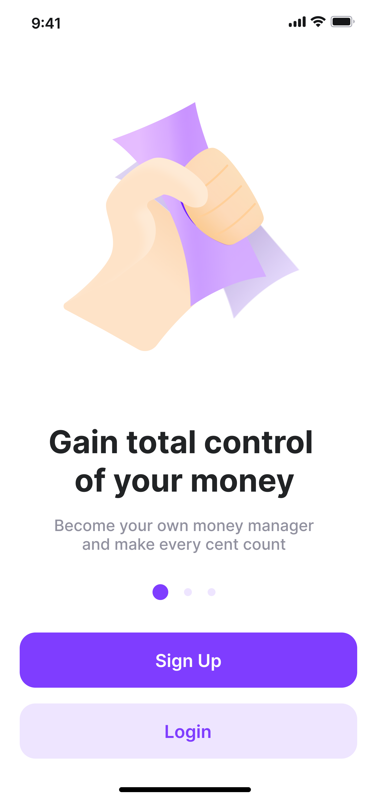
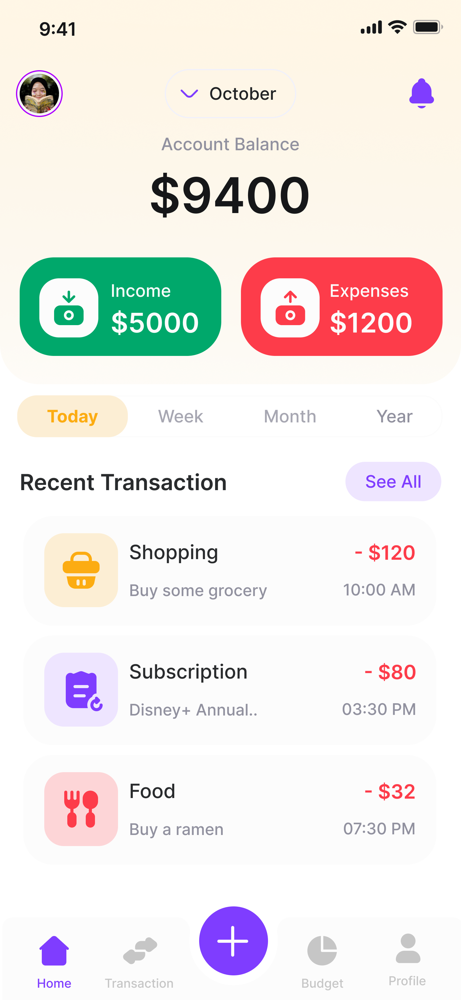
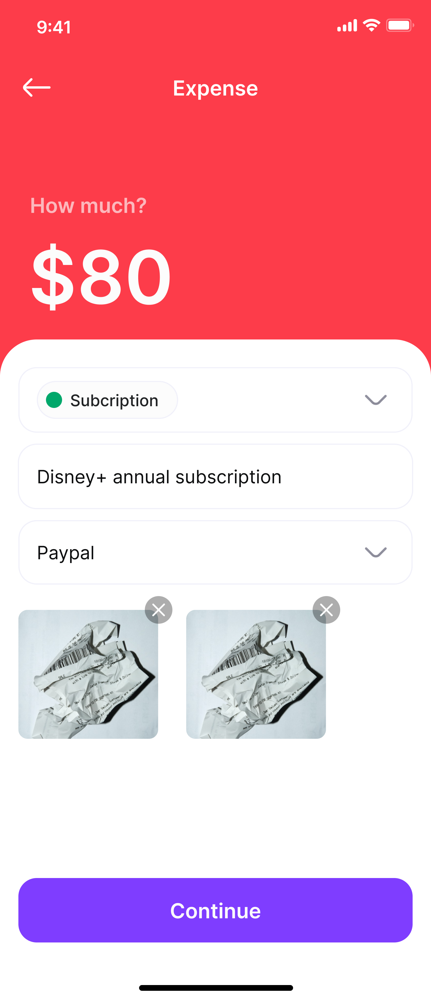
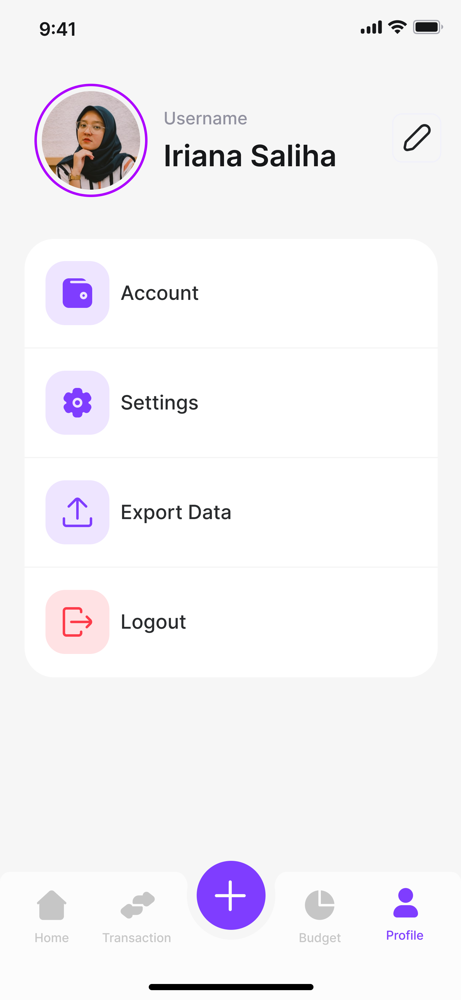
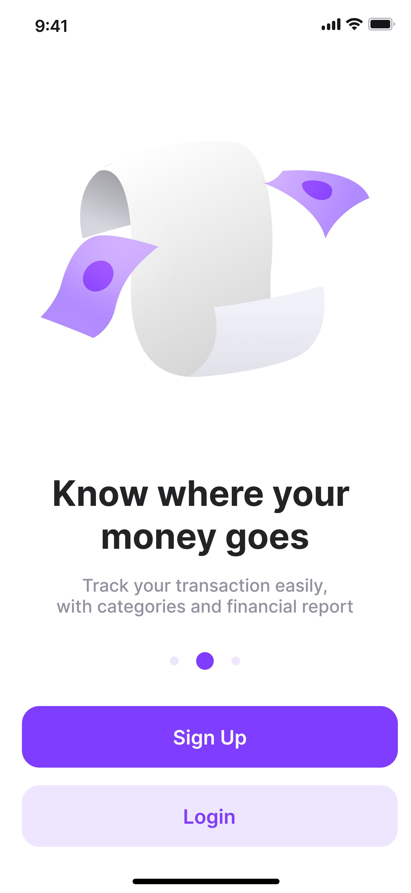
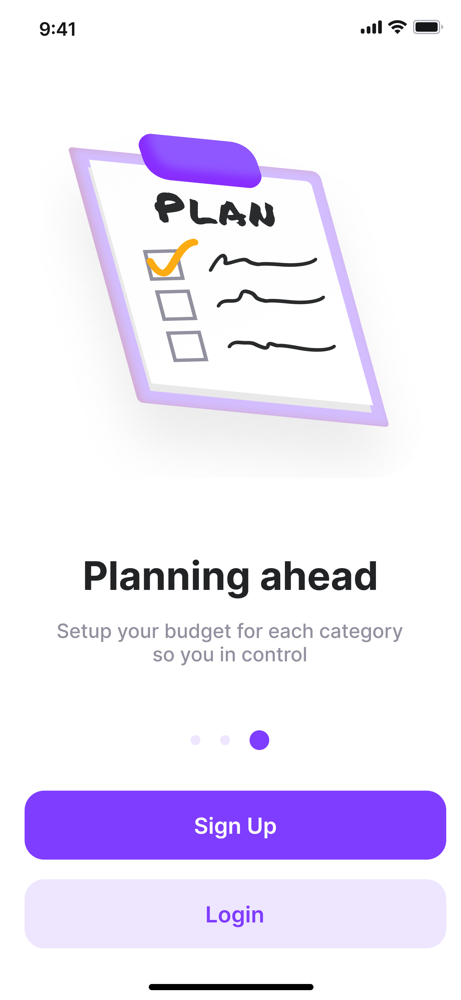
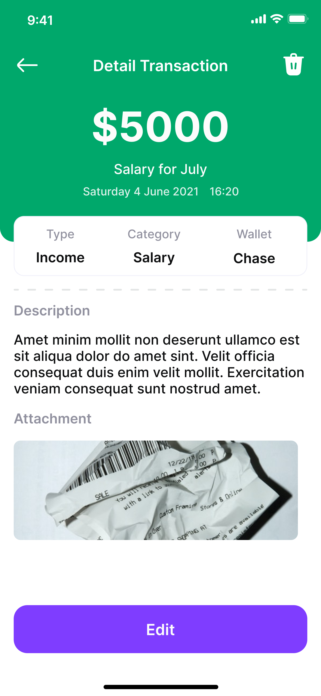
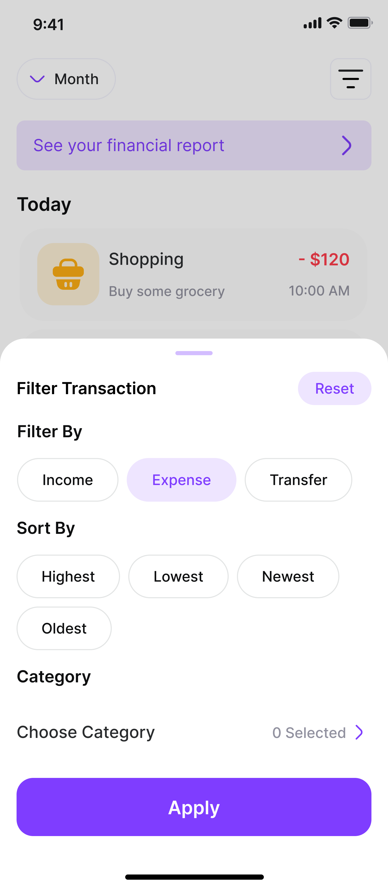
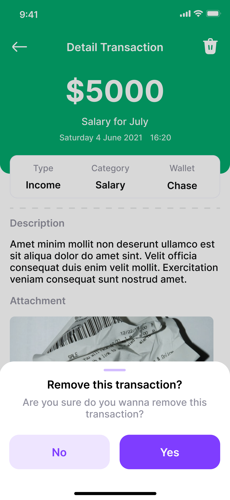

<!-- # 💰 Keeper - Money Expense Tracker

A simple yet powerful app to manage your daily expenses, assign expenses to users, and keep track of where your money goes.

## 🚀 Application Flow

1. **Onboarding Page**
   - Introduction to the app features and flow.

2. **Authentication**
   - Users can **Sign Up** and **Sign In** securely.

3. **Home Page - Expense Overview**
   - View all expenses in one place.
   - Get a clear picture of your spending.

4. **User Management**
   - Navigate to the User List page.
   - Create new users (friends, family, teammates) to assign expenses.

5. **Expense Management**
   - Create new expenses.
   - Assign expenses to specific users.
   - Track individual and group expenses easily.

---

## ✨ Features

✅ Smooth Onboarding Experience  
✅ Secure Login & Signup  
✅ Add, Edit, and Manage Users  
✅ Record Expenses and Assign to Users  
✅ View All Expenses at a Glance  
✅ Clean and User-Friendly Interface  

---

## 🗺️ Application Screens & Flow

| 🛫 **Onboarding**                            | 🔐 **Authentication**            | 🏠 **Home - Expenses**         |
| ------------------------------------------- | ------------------------------- | ----------------------------- |
|  |  |  |

| 👥 **User Management**                   | 📝 **Add Expense**                           |
| --------------------------------------- | ------------------------------------------- |
|  |  |

--- -->

# Keeper

**Keeper** is a simple and intuitive application designed to help users track and manage their expenses efficiently. The app offers features such as adding expenses, viewing detailed transactions, and uploading attachments, making it easy to stay on top of financial management.

## Purpose

The primary purpose of Keeper is to provide users with an easy way to track their daily expenses, monitor spending habits, and organize transactions in one place.

## Features

- **Expense Tracking**: Easily add, view, and manage your expenses.
- **Detailed Transaction View**: Access detailed information about each transaction.
- **Onboarding Process**: Simple onboarding steps to guide new users through the application.
- **Profile Management**: Update and view user profile details.
- **Attachments**: Add receipts or other related documents to your transactions.
- **Transaction Removal**: Ability to remove or edit transactions when needed.

## Technologies Used

This app is built without reliance on specific technologies or frameworks for now.
 ## Screenshots 📸

| 🏠 Home Screen                                         | 💵 Expense Screen                                  |
| ----------------------------------------------------- | ------------------------------------------------- |
|  |  |

| 🚀 Launch Screen                                         | 👤 Profile Screen                                         |
| ------------------------------------------------------- | -------------------------------------------------------- |
|  |  |

| 📄 Onboarding Screen 1                                  | 📄 Onboarding Screen 2                                  |
| ------------------------------------------------------ | ------------------------------------------------------ |
|  |  |

| 📄 Onboarding Screen 3                                  | 📝 Detail Transaction Screen                                  |
| ------------------------------------------------------ | ------------------------------------------------------------ |
|  |  |

| 📎 Expense Filter View                                               | 🗑️ Remove Detail Transaction                                         |
| ------------------------------------------------------------------- | ------------------------------------------------------------------- |
|  |  |

 